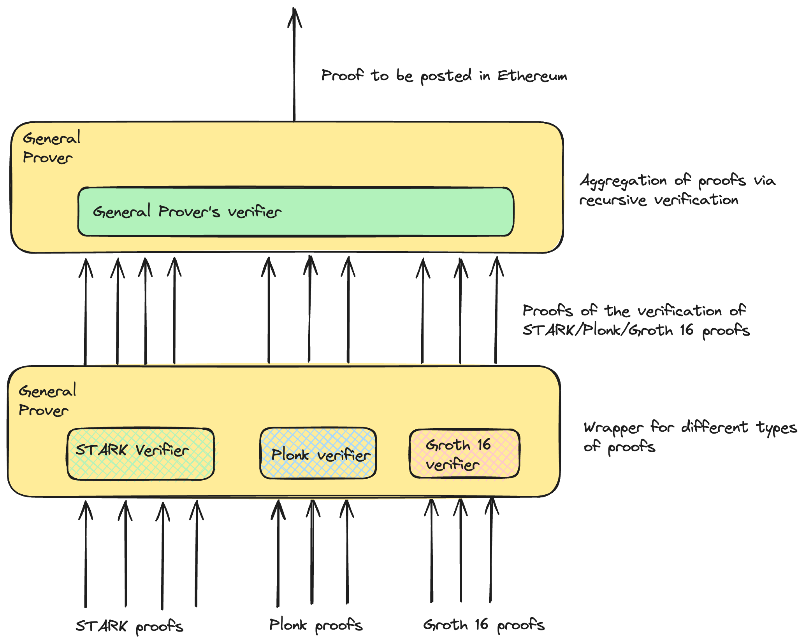

# How does Aligned Layer work?

## Aligned Layer architecture:

The core elements are:

- Aligned Layer: It receives proofs from different proof systems, verifies them, sends the final result to Ethereum, and posts the data into a DA layer.
  
- Data Availability Layer (DA): provides storage for the different proofs.
  
- General Prover/Verifier: Every several days, takes the proofs from the DA layer and generates a proof of the verification of all the proofs. The general prover can be based on the SP1, Risc0 or Nexus virtual machine, which is a virtual machine able to prove general Rust code. The proof of the verification of the proofs is done using the corresponding verifier codes in Rust. The verification can be done using a tree structure.
  
- Ethereum: The source of trust and liquility.

### Interaction between the main components:

1. Aligned Layer receives several proofs from different sources, which could be generated using different proof systems. These have varying proof sizes, verification times, and different verification logic. However, all proofs share a common characteristic: their verification is fast.

2. Aligned Layer has dedicated verifiers, which can be used to check the validity of each of them and post the results to Ethereum.
The proofs are stored in a Data Availability Layer, which offers a cost-efficient storage strategy. The operators in Aligned fetch the proof’s data from this layer.

3. Ethereum receives the verification results from Aligned Layer. However, Ethereum itself does not have access to verify the proofs since this would be too costly. Instead, a general Rust prover generates proof of verification for all the proofs included in a given period (see Figure 2).

4. To aggregate all the proofs, in the first step, all proofs are transformed into proofs of execution of the virtual machine, achieving proof uniformity (see Figure 2). We can then shrink proof size by recursively proving the verification of proofs, as shown in the tree diagram (see Figure 3).

